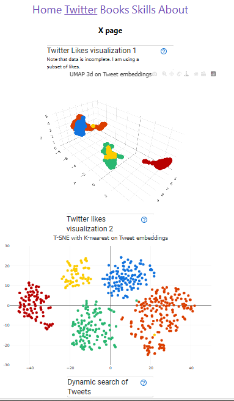
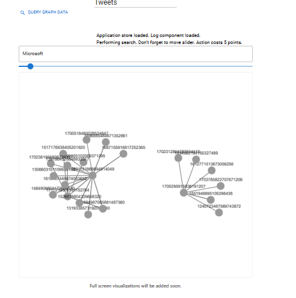
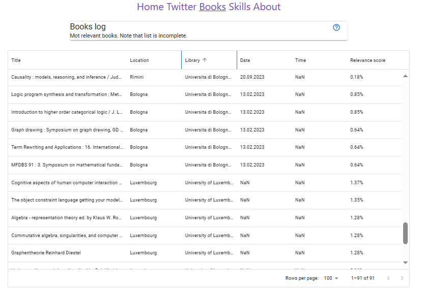
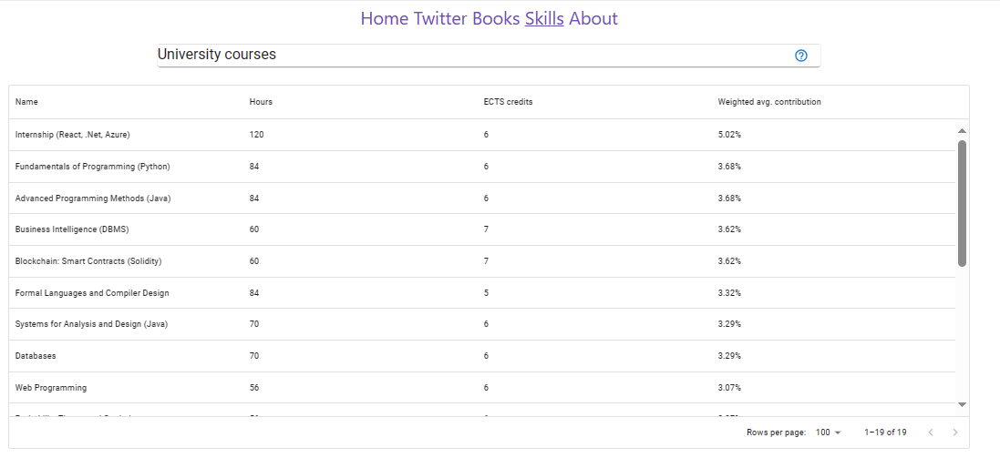
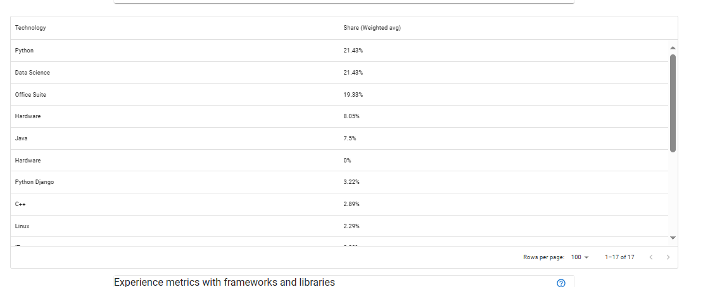
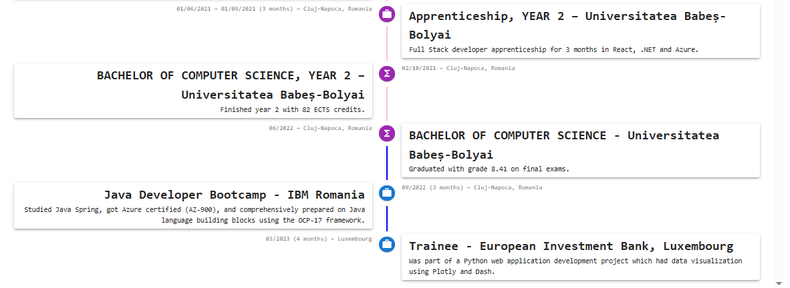
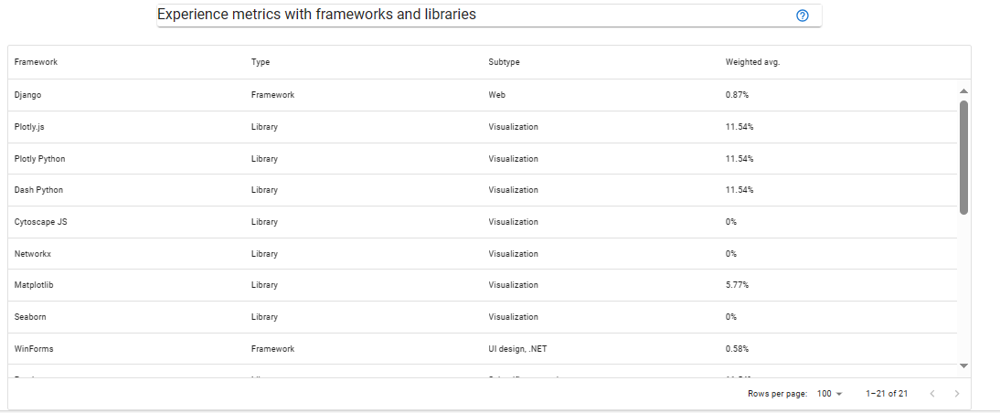

Personal portfolio site:

The goal is to offer some dynamic components for a more dynamic type of personal portfolio site. Some of the components can be connected to real DBs and kept updated as time goes on.

This website can be easily served as an AppService on Azure and does not require any other resources. If one wants to configure a DB of the graph data or UMAP vectors, they could easily configure it by rewriting some of the Async Thunk and Reducer logic.

Commands used:

`npx create-next-app --example with-redux blog-site` - Project init
`yarn run dev` - Sets up the project

Summary:

The React project is able to render Dash objects by one of various strategies, some of which are:

- using a React component from one of the NPM packages
- including a static page from an exported Dash Python project

Some other images of the dynamic elements:

